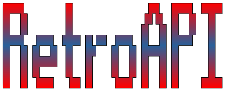

# Proxecto de fin de ciclo DAW

## Descrición

A informática -especificamente a de consumo-, malia ser unha disciplina relativamente nova, xa ten o suficiente tempo como para ter unha pequena historia tras de si. Moitos adultos que foron rapaces nos anos 80 ou 90 do século pasado, lembran con cariño o seu primeiro ordenador ou consola de videoxogos. De feito, non poucos dos profesionais do sector atoparon as posibilidades do mundo dixital trasteando con estes aparellos. 

Ao mesmo tempo, as novas xeracións descubren que, antes dos xogos fotorrealistas en 4K e son 5.1 de hoxe, había outro tipo de videoxogos con menos resolución, píxeles máis grandes, pero tanto ou máis adictivos que os de agora.

Ao redor desta comunidade de nostálxicos/descubridores do pasado da informática, xorde unha pléiade de webs, foros, emuladores, etc. que conforman o *retrocomputing*.

Este proxecto, RetroAPI, ten como obxectivo recompilar a información sobre hardware retro de maneira centralizada e de libre acceso, empregando unha metodoloxía fácil de usar e amplamente comprobada (API REST), para que poda ser utilizada en distintas plataformas e, ao mesmo tempo, sexa doada de manter, actualizar ou engadirlle novas funcionalidades.

## Instalación

> *Tarefa*: Neste apartado describe con toda precisión e, a poder ser, coa maior simplicidade/facilidade posible, como poñer en marcha a túa aplicación para probala (nun entorno local). Valorarase moi positivamente que este proceso sexa o máis fácil posible, cunha simple instrución (por exemplo, un script de instalación).

## Uso

> *Tarefa*: Neste apartado, describe brevemente como se usará o software. Se ten unha interfaz de terminal, describe aquí a súa sintaxe. Se ten unha interfaz gráfica de usuario, describe aquí **só o uso** (a modo de sumario) **dos aspectos máis relevantes do seu funcionamento** (máxima brevidade, como se fose un anuncio reclamo ou comercial).

## Sobre o autor

Apaixonado da informática e especialmente da programación desde a época dos 8 bits, autodidacta nos primeiros tempos, cun certificado de profesionalidade de programación de sistemas informáticos, técnico superior en DAM e (case) en DAW. Pelexando cos sistemas operativos desde o vello CP/M ata os actuais Windows 10, Linux, Android...

**Linguaxes:** C/C++, C#, Visual Basic, Python, Java, PHP, JavaScript (vanilla, jQuery, Node.js), SQL

**Contacto:** a18juancg@iessanclemente.net - jmcardeso@outlook.es

**Por que RetroAPI?**: Porque me permite traballar con tecnoloxías aprendidas no ciclo, avanzando no seu coñecemento ao mesmo tempo que creo unha aplicación que pode ser de utilidade.

## Licenza

RetroAPI  
Autor: Juan Manuel Cardeso García

Este programa é software libre: podes redistribuilo e/ou modificalo baixo os termos da Licenza Xeral Pública de GNU publicada pola Free Software Foundation, xa sexa a versión 3 da Licenza, ou (á túa elección) calquera versión posterior.

Este programa distribúese coa esperanza de que sexa útil pero SEN NINGUNHA GARANTÍA; incluso sen a garantía implícita de MERCANTIBILIDADE ou CUALIFICADA PARA UN PROPÓSITO EN PARTICULAR. Le a Licenza Xeral Pública de GNU para máis detalles.

Debiches recibir unha copia da Licenza Xeral Pública de GNU xunto con este programa. Se non, vai a [http://www.gnu.org/licenses/.](http://www.gnu.org/licenses/)

## Guía de contribución

Desexas contribuír? Calquera contribución é benvida. Sigue, por favor, [estas instruccións](CONTRIBUTING.md).

## Memoria

> *Tarefa*: Indexa de forma ordenada a memoria do teu proxecto.
> Durante a redacción da memoria, debes ir completando progresivamente o anexo de Referencias.

1. [Estudo preliminar](doc/templates/1_estudo_preliminar.md)
2. [Análise: Requerimentos do sistema](doc/templates/2_analise.md)
3. [Deseño](doc/templates/3_deseno.md)
4. [Codificación e Probas](doc/templates/4_codificacion_probas.md)
5. [Manuais](doc/templates/5_manuais.md)

#### Anexos

1. [Referencias](doc/templates/a1_referencias.md)
2. [Planificación](doc/templates/a2_planificacion.md)
3. [Orzamento](doc/templates/a3_orzamento.md)
