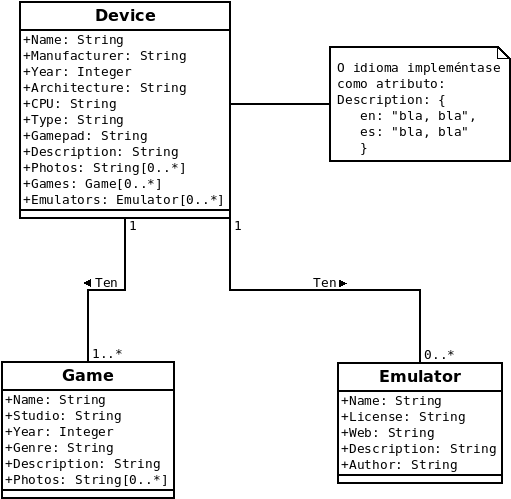

# Deseño

RetroAPI pretende fornecer de maneira gratuíta a calquera usuario información sobre *retrocomputing*. Para iso, como se detallou na [análise](./2_analise.md), é preciso contar cun sistema xestor de bases de datos que permita realizar as operacións típicas  de creación, lectura, actualización e eliminación (CRUD) e que sexa rápido e flexible, para poder ampliar a información recollida ou engadir traduccións a outros idiomas con facilidade.  

Desde hai uns anos, os sistemas NonSQL son cada vez máis utilizados pola súa flexibilidade ao non precisar de estruturas ríxidas como as táboas dos vellos sistemas relacionais. Dentro dos sistemas NonSQL, o de maior aceptación é, sen dúbida, MongoDB, un sistema de base de datos orientado a documentos que, polas súas características, é a opción máis acaída para este proxecto.

Para conectar a base de datos cos potenciais usuarios, empregarase unha interface (API) desenvolvida como servizo web que use a metodoloxía REST, pola súa facilidade de uso e idoneidade para usar co protocolo HTTP.

A API estará desenvolvida utilizando Node.js, que utiliza JavaScript no lado do servidor e conta con multitude de módulos, propios e feitos pola comunidade, que permiten ao programador centrarse nas funcionalidades da súa aplicación e non en aspectos, como a creación dun servidor web, xa creados e probados por moitos outros usuarios.

Os usuarios da API terán dous tipos de acceso: un totalmente público (sen necesidade de autenticarse) para poder consumir os datos e outro no que se precisará autenticación para modificar, engadir ou borrar datos. O proceso de autenticación farase utilizando **TODO**. Implementarase tamén un arquivo de *log*, onde queden rexistrados os accesos ao servidor; para isto, empregarase express-logger-unique-req-id, módulo de Node.js que mistura o módulo Winston para logs coa posibilidade de engadir ids únicas para cada petición á API.

Ademais da API, crearase unha pequena web de demostración do consumo dos datos. O deseño estará feito en Bootstrap que, como no caso das ferramentas xa mencionadas, permite aforrar tempo de desenvolvemento ao proporcionar moitas das funcionalidades necesarias.

## Modelo conceptual do dominio da aplicación

## Casos de uso

