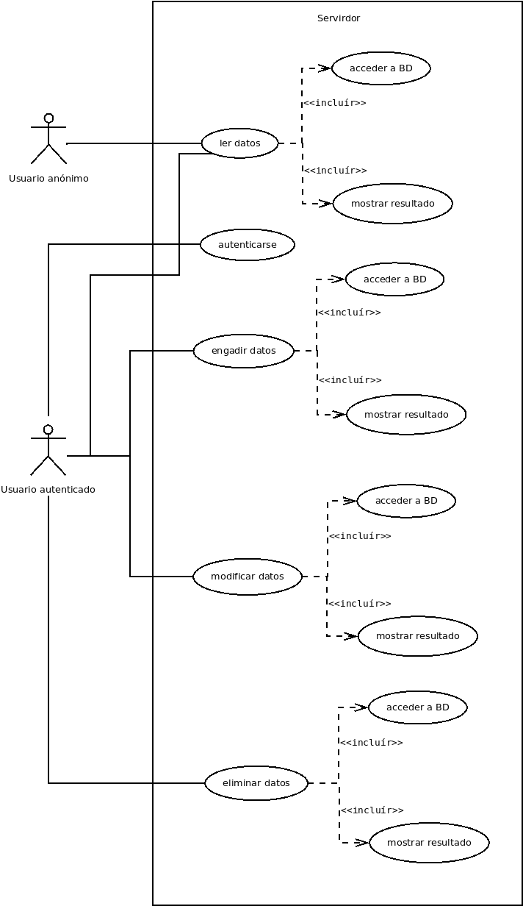

# Deseño

Unha vez realizada a fase de análise, debemos ter como resultado un listado de tarefas ou funcións a implementar. Nesta fase, debemos deseñar os algoritmos para implementar cada unha das funcións (cun diagrama ou pseudocódigo). Isto soamente debería ser necesario para funcións ou tarefas complexas que requiran de pasos máis pequenos para a súa implementación.

Unha vez realices esta fase, remata de completar o último anexo: Orzamento.

------------------------

RetroAPI pretende fornecer de maneira gratuíta a calquera usuario información sobre *retrocomputing*. Para iso, como se detallou na [análise](./2_analise.md), é preciso contar cun sistema xestor de bases de datos que permita realizar as operacións típicas  de creación, lectura, actualización e eliminación (CRUD) e que sexa rápido e flexible, para poder ampliar a información recollida ou engadir traduccións a outros idiomas con facilidade.  

Desde hai uns anos, os sistemas NonSQL son cada vez máis utilizados pola súa flexibilidade ao non precisar de estruturas ríxidas como as táboas dos vellos sistemas relacionais. Dentro dos sistemas NonSQL, o de maior aceptación é, sen dúbida, MongoDB, un sistema de base de datos orientado a documentos que, polas súas características, é a opción máis acaída para este proxecto.

Para conectar a base de datos cos potenciais usuarios, empregarase unha interface (API) desenvolvida como servizo web que use a metodoloxía REST, pola súa facilidade de uso e idoneidade para usar co protocolo HTTP.

A API estará desenvolvida utilizando Node.js, que utiliza JavaScript no lado do servidor e conta con multitude de módulos, propios e feitos pola comunidade, que permiten ao programador centrarse nas funcionalidades da súa aplicación e non en aspectos, como a creación dun servidor web, xa creados e probados por moitos outros usuarios.

Os usuarios da API terán dous tipos de acceso: un totalmente público (sen necesidade de autenticarse) para poder consumir os datos e outro no que se precisará autenticación para modificar, engadir ou borrar datos. O proceso de autenticación farase utilizando **TODO**. Implementarase tamén un arquivo de *log*, onde queden rexistrados os accesos ao servidor; para isto, empregarase **TODO**.

Ademais da API, crearase unha pequena web de demostración do consumo dos datos. O deseño estará feito en Bootstrap que, como no caso das ferramentas xa mencionadas, permite aforrar tempo de desenvolvemento ao proporcionar moitas das funcionalidades necesarias.

## Modelo conceptual do dominio da aplicación

Pode ser un diagrama de clases usando UML, ConML, ou outra linguaxe semellante.

## Casos de uso

## Deseño de interface de usuarios

Unha forma de axudar ó deseño da aplicación é realizar uns mockups: pódelos facer á man ou cunha aplicación ou a través dunha web do estilo: https://app.diagrams.net/

Os mockups deben incluir todas as vistas da aplicación, é dicir, todas as páxinas diferentes que un usuario (de calquera tipo) vai a poder ver. Un mockup permite ver como se verá unha páxina concreta da nosa aplicación web. O deseño de mockups vainos axudar a:

- Avanzar moi rápido na parte frontend: ao ter os mockups realizados, xa sabemos que elementos vai ter cada vista e onde colocalos. Podes empregar un framework CSS ou programar as follas de estilos.
- Visualizar a información que vai a ser necesaria mostrar. Sabendo con que información imos traballar e sabendo a información que necesitamos mostrar ao usuarios, podemos organizar os datos dunha forma axeitada para gardalos na base de datos. 

## Diagrama de Base de Datos.

Nesta fase tamén teremos que realizar:

- Modelo Entidade/relación 
- Modelo relacional 

Poderedes entregar a captura do phpMyAdmin se empregades MariaDB como Modelo relacional.
